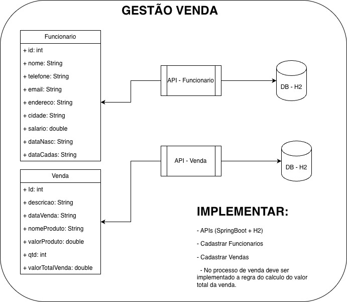

# Sistema de Gestão de Vendas

Este repositório contém a implementação da atividade de Gestão de Vendas, que consiste no desenvolvimento de duas APIs distintas utilizando uma arquitetura baseada em microsserviços.

## Sobre a Atividade

A atividade proposta exige a criação de duas APIs separadas para gerenciar Funcionários e Vendas, além da implementação de uma regra de negócio específica no processo de venda.

Os requisitos principais da atividade são:
- Desenvolver as APIs utilizando o framework Spring Boot.
- Utilizar o banco de dados em memória H2 para persistência de dados.
- Implementar o cadastro de Funcionários.
- Implementar o cadastro de Vendas.
- Implementar a regra de negócio que calcula automaticamente o valor total da venda (valor do produto multiplicado pela quantidade).

## Tecnologias Utilizadas

- **Java**: Linguagem base do projeto.
- **Spring Boot**: Framework utilizado para a criação rápida e simplificada das APIs REST, configurando automaticamente dependências e o servidor web embutido.
- **Spring Data JPA**: Utilizado para o mapeamento objeto-relacional e facilitação das operações de banco de dados.
- **H2 Database**: Banco de dados em memória utilizado para armazenar os dados do sistema, facilitando o desenvolvimento sem a necessidade de infraestrutura externa.

## Estrutura do Projeto

O projeto foi dividido em dois subprojetos independentes para respeitar a arquitetura proposta:

- `at-ipoo_01-api_funcionario`: API responsável pelo gerenciamento e persistência dos dados dos funcionários.
- `at-ipoo_02-api_venda`: API responsável pelo gerenciamento, persistência das vendas e aplicação da regra de cálculo do valor total.

## Diagrama da Atividade

Abaixo está o diagrama UML que serviu como base arquitetural para a implementação do projeto.

